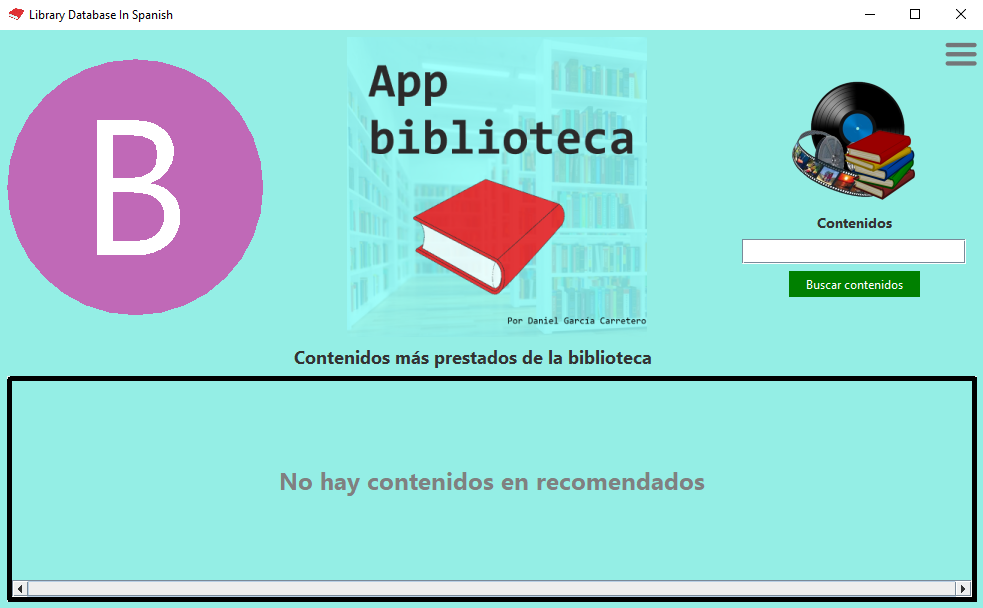

# Library Database In Spanish




# Requisitos previos
- Tener [Java](https://www.java.com/en/) instalado (Como mínimo la versión JRE 17)
- Tener [Maven](https://maven.apache.org/) instalado (Como mínimo versión 3.8)
- Tener [Sqlite](https://www.sqlite.org/) instalado (Como mínimo version 3.38)
# Cómo ejecutarlo
1. Abre una terminal en el directorio del proyecto.

2. Ejecuta el siguiente comando para hacer la build de la aplicación:
>```console
>mvn clean package
>```

3. Ejecuta el siguiente comando para ejecutar la aplicación:
>```console 
>java -jar target/DatabaseInSpanish-(version).jar
>```
